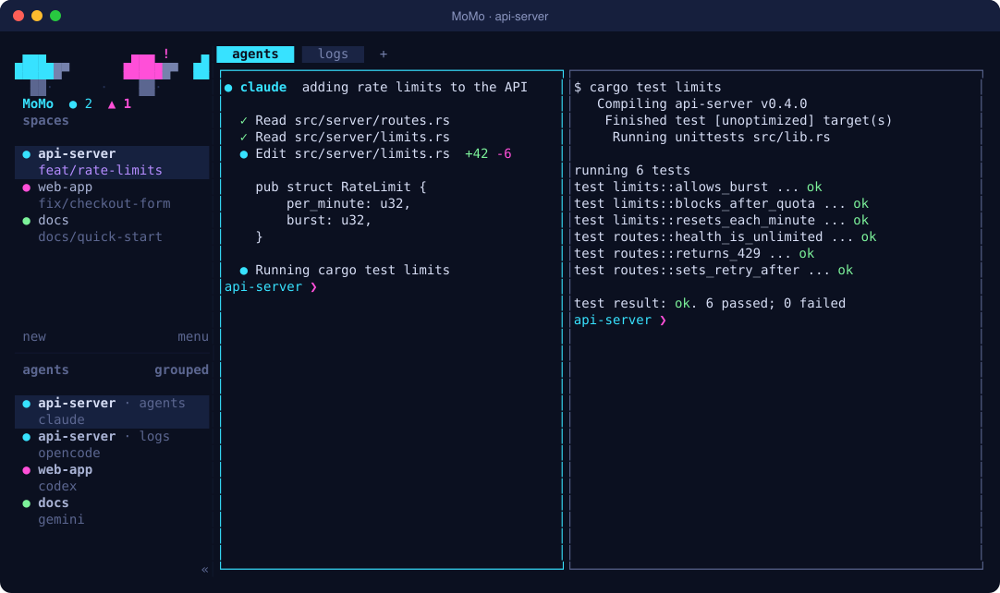
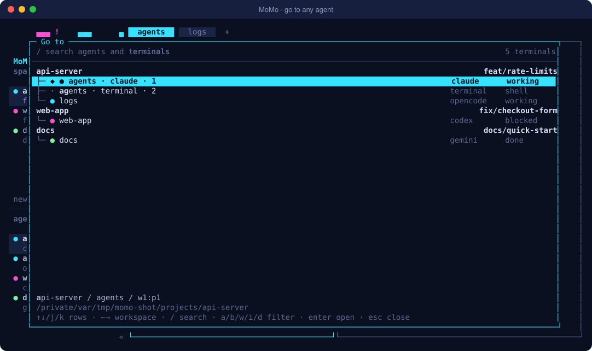
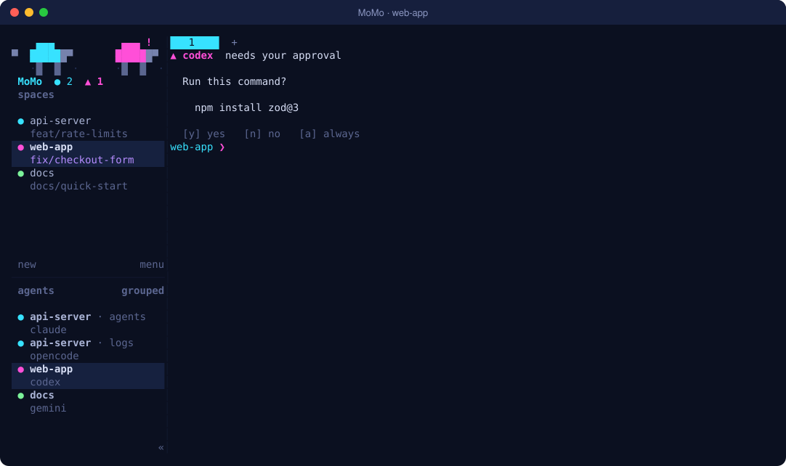
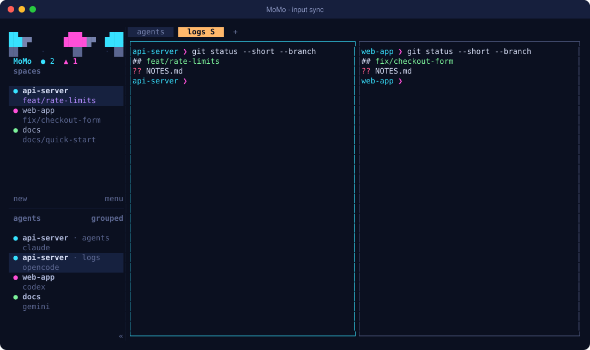

<p align="center">
  
</p>

<p align="center">
  <a href="https://github.com/iiMoham/momo/releases/latest"></a>
  <a href="https://github.com/iiMoham/momo/actions/workflows/momo-ci.yml"></a>
  
  <a href="LICENSE"></a>
</p>

<p align="center">
  <a href="#install">Install</a> · <a href="#keyboard-shortcuts">Shortcuts</a> · <a href="#command-line">Commands</a> · <a href="docs/">Docs</a>
</p>

MoMo is a terminal workspace for people who run several coding agents at once. Claude Code, Codex,
Gemini, OpenCode, and the rest each get a pane, the sidebar shows which of them are working, which
are done, and which are waiting on you, and everything keeps running when you close the window or
lose your SSH connection. It runs on macOS and Linux, inside the terminal app you already use.

<p align="center">
  
</p>

## Install

```bash
curl -fsSL https://github.com/iiMoham/momo/releases/latest/download/install.sh | sh
momo
```

The installer picks the build for your machine, checks its SHA-256 checksum, and puts `momo` in
`~/.local/bin`. The command is the same in any terminal app and any shell, because it hands the
script to `sh`. `momo update` installs new releases.

<details>
<summary>Install details for macOS, Linux, Windows, your PATH, and other options</summary>

#### macOS

Open any terminal app and run the command above. `curl` ships with macOS. If `momo` is not found
afterwards, add `~/.local/bin` to your `PATH` (see the PATH table below).

#### Linux

The installer needs `curl` (it already uses `sh`, `awk`, and `sha256sum`, which every distribution
has). Install `curl` if it is missing, then run the command above:

| Distribution | Install curl |
| --- | --- |
| Ubuntu, Debian, Mint, Pop!_OS | `sudo apt install -y curl` |
| Fedora, RHEL, CentOS Stream | `sudo dnf install -y curl` |
| Arch, Manjaro | `sudo pacman -S --needed curl` |
| openSUSE | `sudo zypper install -y curl` |
| Alpine | `sudo apk add curl` |

Linux binaries are fully static, so they run on any distribution and C library (glibc or musl).

#### Windows (WSL)

MoMo has no native Windows build. Run it in WSL 2, which gives you a real Linux shell inside Windows
Terminal:

```powershell
wsl --install          # in PowerShell as Administrator, once; then restart
```

Open Ubuntu from the Start menu (or a WSL tab in Windows Terminal) and run the Linux command
above. WSL support is not tested by us yet; please report problems.

#### Add momo to your PATH

The installer tells you when `~/.local/bin` is not on your `PATH`. Add it for your shell, then open a
new terminal:

| Shell | Command |
| --- | --- |
| zsh (macOS default) | `echo 'export PATH="$HOME/.local/bin:$PATH"' >> ~/.zshrc` |
| bash on Linux / WSL | `echo 'export PATH="$HOME/.local/bin:$PATH"' >> ~/.bashrc` |
| bash on macOS | `echo 'export PATH="$HOME/.local/bin:$PATH"' >> ~/.bash_profile` |
| fish | `fish_add_path ~/.local/bin` |

#### Install options

```bash
# Install somewhere else (for example, system-wide):
curl -fsSL https://github.com/iiMoham/momo/releases/latest/download/install.sh | sudo env MOMO_INSTALL_DIR=/usr/local/bin sh

# Install a specific release:
curl -fsSL https://github.com/iiMoham/momo/releases/latest/download/install.sh | MOMO_VERSION=0.9.1-momo.2 sh
```

| | |
| --- | --- |
| Update | `momo update` downloads the latest MoMo release |
| Version | `momo --version`, for example `momo 0.9.1-momo.2` |
| Uninstall | `rm ~/.local/bin/momo`, and `rm -r ~/.config/momo ~/.local/state/momo` to remove config and sessions |

</details>

## What you get

<table>
<tr>
<td width="33%" valign="top"><br>A herd you can read at a glance<br><sub>One pixel sheep per agent. They walk while agents work, nap when all is quiet, and a blinking <code>!</code> marks the one that needs you.</sub></td>
<td width="33%" valign="top"><br>Type into every pane at once<br><sub>Input sync sends your typing to all panes of a tab, like tmux's synchronize-panes. Synced tabs show an <code>S</code>.</sub></td>
<td width="33%" valign="top"><br>Pane output for scripts<br><sub><code>momo pane watch</code> prints a JSON line for every screen change, so a script can follow an agent without polling.</sub></td>
</tr>
<tr>
<td valign="top"><br>Safer worktree cleanup<br><sub>Before removing a Git worktree, MoMo checks nested repositories for uncommitted or unpushed work and refuses to lose it unless you say so.</sub></td>
<td valign="top"><br>One key per task<br><sub>The workstream plugin creates a branch, a worktree, and your pane layout in one step, and later removes the checkout while keeping the branch.</sub></td>
<td valign="top"><br>Notifications that take you there<br><sub>On macOS, clicking an agent's notification brings your terminal forward with that agent's pane focused.</sub></td>
</tr>
</table>

Sessions survive a closed window, a crash of your terminal app, and a dropped SSH connection. Run
`momo` again to get everything back, or attach from another machine with `momo --remote host`.
MoMo detects most coding agents on its own, and `momo integration install claude` (or codex,
opencode, and others) adds hooks that report their state exactly.

<table>
<tr>
<td width="50%"><br><sub><code>prefix+g</code> lists every agent and terminal with its state. Type to search, press Enter to jump.</sub></td>
<td width="50%"><br><sub>Codex is waiting for approval. Its sheep, its sidebar dot, and the counter all turn magenta.</sub></td>
</tr>
<tr>
<td colspan="2"><br><sub>With input sync on, one command runs in both repositories.</sub></td>
</tr>
</table>

## Getting started

The prefix is `ctrl+b`: press it, let go, then press the next key. These five cover most days:

| Action | Keys |
| --- | --- |
| New tab | `prefix+c` |
| Split side by side / stacked | `prefix+v` / `prefix+minus` |
| Move between panes | `prefix+h` `j` `k` `l` |
| Jump to any agent | `prefix+g` |
| Detach and leave everything running | `prefix+q` |

Everything also works with the mouse: click panes, tabs, and agents, drag borders to resize, and
right-click for menus. `prefix+?` shows every shortcut inside MoMo.

MoMo keeps its settings in `~/.config/momo/config.toml`. `momo --default-config` prints a commented
example, and `momo config check` validates yours. The midnight-neon theme looks best on a terminal
background of `#0b1020`; set `[ui] animation = false` to stop the herd.

## Keyboard shortcuts

<details>
<summary>Every default shortcut, the keys inside each mode, and how to change them</summary>

#### Start with these

| Action | Keys |
| --- | --- |
| New tab | `prefix+c` |
| Split side by side / stacked | `prefix+v` / `prefix+minus` |
| Move between panes | `prefix+h` `j` `k` `l` (left, down, up, right) |
| Workspace navigation | `prefix+w` |
| Detach and leave everything running | `prefix+q` |

#### Panes

| Action | Keys |
| --- | --- |
| Focus pane left / down / up / right | `prefix+h` / `prefix+j` / `prefix+k` / `prefix+l` |
| Swap pane left / down / up / right | `prefix+shift+h` / `prefix+shift+j` / `prefix+shift+k` / `prefix+shift+l` |
| Next / previous pane | `prefix+tab` / `prefix+shift+tab` |
| Split side by side | `prefix+v` |
| Split stacked | `prefix+minus` |
| Zoom (full size) on / off | `prefix+z` |
| Close pane | `prefix+x` |
| Rename pane | `prefix+shift+p` |
| Resize mode | `prefix+r` |
| Copy mode | `prefix+[` |
| Open scrollback in `$EDITOR` | `prefix+e` |

#### Tabs

| Action | Keys |
| --- | --- |
| New tab | `prefix+c` |
| Next / previous tab | `prefix+n` / `prefix+p` |
| Go to tab 1 to 9 | `prefix+1` … `prefix+9` |
| Rename tab | `prefix+shift+t` |
| Close tab | `prefix+shift+x` |

#### Workspaces, agents, and the app

| Action | Keys |
| --- | --- |
| Workspace navigation | `prefix+w` |
| Goto picker (jump to any agent or terminal) | `prefix+g` |
| New workspace | `prefix+shift+n` |
| New Git worktree workspace | `prefix+shift+g` |
| Rename workspace | `prefix+shift+w` |
| Close workspace | `prefix+shift+d` |
| Jump to the notification's pane | `prefix+o` |
| Show / hide the sidebar | `prefix+b` |
| Settings | `prefix+s` |
| All shortcuts (help) | `prefix+?` |
| Reload config | `prefix+shift+r` |
| Detach | `prefix+q` |
| Paste a clipboard image into a remote session | `ctrl+v` |

#### Inside a mode

| Mode | Keys |
| --- | --- |
| Workspace navigation (`prefix+w`) | `↑`/`↓` choose workspace · `1` to `9` jump to workspace · `h` `j` `k` `l` or `←`/`→` move focus · `tab`/`shift+tab` cycle panes · `enter` open · `esc` back |
| Resize (`prefix+r`) | `h`/`l` width · `j`/`k` height · `esc` done |
| Copy (`prefix+[`) | `h` `j` `k` `l`, `w`/`b`/`e`, `{`/`}` move · `/` or `?` search, `n`/`N` next/previous · `v` or `space` select · `y` or `enter` copy · `q` or `esc` exit |
| Goto picker (`prefix+g`) | `↑`/`↓` or `j`/`k` move · `/` search · `b`/`w`/`i`/`d` show blocked/working/idle/done agents · `a` all · `enter` jump |

In MoMo's text fields (names, filters, search): `ctrl+a`/`ctrl+e` start/end, `alt+b`/`alt+f` by word,
`ctrl+u`/`ctrl+k` cut to start/end, `ctrl+w` cut previous word, `ctrl+y` paste the cut text.

#### Not bound by default

These actions exist but have no key until you give them one:
`toggle_input_sync` (type into every pane of the tab), `last_pane`, `previous_workspace`,
`next_workspace`, `switch_workspace` (1 to 9), `previous_agent`, `next_agent`, `focus_agent` (1 to 9),
`move_tab_previous`, `move_tab_next`, `open_worktree`, `remove_worktree`, `clear_pane`, and
`resize_pane_left` / `_down` / `_up` / `_right`.

#### Change shortcuts

Edit `~/.config/momo/config.toml`, then run `momo server reload-config` (or press `prefix+shift+r`):

```toml
[keys]
prefix = "ctrl+a"                               # tmux-style prefix
toggle_input_sync = "prefix+i"                  # bind an unbound action
next_tab = ["prefix+n", "ctrl+alt+]"]           # several keys for one action
switch_workspace = "prefix+shift+1..9"          # numbered shortcuts
focus_agent = "prefix+alt+1..9"
```

`ctrl+alt+…` chords are the safest prefix-free choice: terminals, shells, and desktops rarely use
them. Avoid `ctrl+alt+arrows` (GNOME, Ghostty, Konsole), `ctrl+alt+t` (opens a terminal on Ubuntu
and Fedora), `ctrl+alt+l` (KDE lock screen), and `ctrl+alt+f1`…`f12` (Linux consoles). If a shortcut
does nothing, your terminal or desktop took it first. `momo config reset-keys` restores the defaults
(it backs up your config first).

</details>

## Command line

Every command works from any shell, including inside a MoMo pane, where it targets the current
session. `momo <group> --help` lists the options.

<details>
<summary>All command groups</summary>

| Command | What it does |
| --- | --- |
| `momo` | Start MoMo or attach to the running session |
| `momo --session <name>` | Use or create a named session |
| `momo --remote <ssh-target>` | Attach to MoMo on another machine over SSH |
| `momo status` | Show client and server status |
| `momo update` | Update to the latest MoMo release |
| `momo --version` / `momo --help` | Version / help |
| `momo --skill` | Print the guide that tells coding agents how to drive MoMo |
| `momo session list \| attach \| stop \| delete` | Manage named sessions |
| `momo server stop \| reload-config` | Stop the server / reload `config.toml` |
| `momo config check \| reset-keys` | Validate the config / restore default shortcuts |
| `momo workspace list \| create \| get \| focus \| rename \| close` | Workspaces |
| `momo tab list \| create \| get \| focus \| rename \| close` | Tabs |
| `momo tab sync on \| off \| toggle` | Type into every pane of a tab |
| `momo pane list \| get \| split \| focus \| zoom \| resize \| swap \| move \| rename \| close` | Panes |
| `momo pane read \| send-text \| send-keys \| run` | Read a pane or type into it |
| `momo pane wait-output \| watch` | Wait for text / stream every change as JSON |
| `momo agent list \| get \| read \| prompt \| send-keys \| wait \| focus \| start \| rename` | Work with coding agents |
| `momo worktree list \| create \| open \| remove \| removal-check` | Git worktrees as workspaces |
| `momo machine list \| add \| status \| reconnect \| rename \| remove` | Saved SSH machines |
| `momo integration install \| uninstall \| status <agent>` | Agent hooks (claude, codex, …) |
| `momo plugin install \| link \| list \| enable \| disable \| action \| log` | Plugins |
| `momo notification show` | Show a notification |
| `momo completion <shell>` | Shell completions (below) |

</details>

<details>
<summary>Shell completions for zsh, bash, fish, PowerShell, and Elvish</summary>

Run the line for your shell once, then open a new terminal.

| Shell | Setup |
| --- | --- |
| zsh | `mkdir -p ~/.zfunc && momo completion zsh > ~/.zfunc/_momo`, then add `fpath=(~/.zfunc $fpath); autoload -Uz compinit && compinit` to `~/.zshrc` |
| bash | `mkdir -p ~/.local/share/bash-completion/completions && momo completion bash > ~/.local/share/bash-completion/completions/momo` (needs the `bash-completion` package) |
| fish | `momo completion fish > ~/.config/fish/completions/momo.fish` |
| PowerShell (`pwsh`) | `momo completion powershell >> $PROFILE` |
| Elvish | `momo completion elvish >> ~/.config/elvish/rc.elv` |

</details>

<details>
<summary>Terminal setup: Option as Alt on macOS, right-click menus</summary>

Some shortcuts use Alt, such as Alt+B and Alt+F to move by word in MoMo's text fields. macOS
terminals type special characters with Option until you change this setting:

| Terminal | Setting |
| --- | --- |
| Terminal.app | Settings, Profiles, Keyboard: Use Option as Meta key |
| iTerm2 | Settings, Profiles, Keys, General: Left Option key: Esc+ |
| Ghostty | `macos-option-as-alt = true` |
| kitty | `macos_option_as_alt left` in `kitty.conf` |
| Alacritty | `option_as_alt = "OnlyLeft"` under `[window]` |
| WezTerm | works by default with the left Option key |

Linux and Windows terminals send Alt as it is. In iTerm2, right-click menus need Settings, Profiles,
Terminal: Enable mouse reporting. If right-click still opens iTerm's own menu, remove the right-click
entry under Settings, Pointer, Bindings.

</details>

## Documentation

The [docs](docs/) folder has a page per topic. Good places to start:

- [Quick start](docs/quick-start.md) and [concepts](docs/concepts.md)
- [Configuration](docs/configuration.md) and the [config reference](docs/config-reference.md)
- [Agents](docs/agents.md) and [integrations](docs/integrations.md)
- [Remote machines](docs/connecting-machines.md) and [what survives a restart](docs/session-state.md)
- [Plugins](docs/plugins.md), the [socket API](docs/socket-api.md), and the [CLI reference](docs/cli-reference.md)
- [Troubleshooting](docs/troubleshooting.md)

Coding agents can learn to drive MoMo from `momo --skill`.

## Building from source

You need Rust 1.96 or newer and Zig 0.16.

```bash
git clone https://github.com/iiMoham/momo && cd momo
cargo build --release
./target/release/momo --version
```

[CONTRIBUTING.md](CONTRIBUTING.md) covers tests and pull requests, and
[packaging/momo/README.md](packaging/momo/README.md) covers releases.

## License

Apache License 2.0. See [LICENSE](LICENSE) and [NOTICE](NOTICE).
